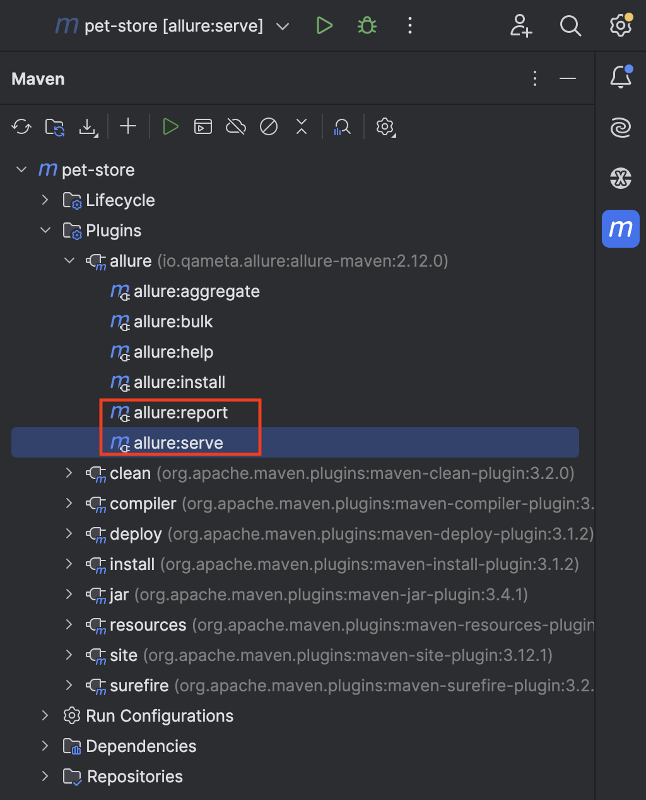

# Swagger PetStore API

Tech stack:
* [Java 11](https://www.oracle.com/cis/java/technologies/javase/jdk11-archive-downloads.html) as a main programming language
* [RestAssured](https://rest-assured.io) as a library for API requests
* [Allure Report](https://allurereport.org) as  a reporting tool
* [TestNG](https://testng.org) as a a testing framework

## Framework structure

* **pom.xml** - is a Maven file, which contains information regarding project, dependencies and plugins
* **testngXml** directory - contains .xml configuration files of the TestNG framework (test suites) 
* **src** directory - contains two directories:
  * **main** - directory that contains code that is not connected with the test scenarios directly
  * **test** - directory that contains test scenarios and all additional artifacts for that

## Creating and Running Automated Test Scenarios

1. Create RestApi tests in specific directory.
2. Add test classes to *.xml file.
3. Open terminal and go to the project directory
4. Run command

`mvn clean -Dsuite=regression.xml test`

### Alternative way:
1. Open testngXml folder
2. Right click on regression.xml file
3. Select "Run regression.xml"

## Report
To generate Allure Reports start any of the commands below:

Or copy and start any of the commands below in your terminal:
* `allure serve target/allure-results` (to start server and open report in browser)
* `allure generate target/allure-results` (to generate report locally)
* `allure open` (to open local report)

